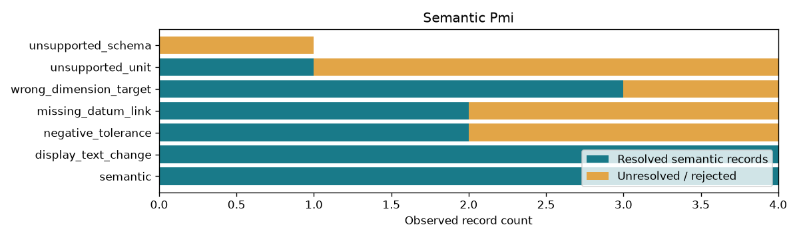

# Semantic PMI, Datums, and Tolerances

## 日本語概要

v0.66.0ではPMIの意味・データム・公差を実装し、7件の限定した合成条件を検証しました。入力・判断根拠・結果をCSV、JSON、図、再生成可能なサンプルに残しています。

検証範囲と失敗例は以下の英語本文に示します。一般のCADデータへの適用や完全な規格適合を主張するものではありません。

---

## English Summary

The reader follows selected AP242 roles with exact entity spans and explicit SI length measures. It accepts only the declared mappings and reports unsupported schemas, units, targets and modifiers. The synthetic file establishes product ownership but does not bind a shape aspect to a native face. It is a role-level semantic study, not complete AP242 or GD&T validation.

## Results and Interpretation

Seven source controls separate dimensions, flatness, position tolerance, datum establishment and presentation text. The diameter stays 4 mm when the display says 999 mm or 123 mm. An invalid establishing datum relationship also invalidates its dependent position tolerance.

The 7 `checks_pass` observations check the declared expectation, including
expected rejections and recorded learning failures. They do not mean that every
input was accepted or every learned prediction was correct.

## Sources and Implementation Boundary

[STEP Tools dimensional size](https://www.steptools.com/docs/stp_aim/html/t_dimensional_size.html), [dimensional representation](https://www.steptools.com/docs/stp_aim/html/t_dimensional_characteristic_representation.html), [geometric tolerance](https://www.steptools.com/docs/stp_aim/html/t_geometric_tolerance.html), and [datum](https://www.steptools.com/docs/stp_aim/html/t_datum.html) define the inspected attribute roles. The repository implements a narrow reading of those roles, not the complete merged schema.

- controlled AP242 dimension, flatness, position and legacy datum-reference paths only; no full schema or GD&T conformance
- presentation text never determines semantic dimensions; source spans and unit links are retained
- no face binding inferred from names; geometry attachments and modern datum systems remain deferred

## Reproduction and Artifacts

Run from the repository root in the pinned geometry environment:

```bash
python experiments/run_semantic_pmi.py
```

Default runs verify fixture bytes. To regenerate into separate directories:

```bash
python experiments/run_semantic_pmi.py --output-dir output/semantic-pmi --fixture-dir output/fixtures/semantic-pmi --refresh-fixtures
```

- [Observations](../results/semantic_pmi.csv)
- [Detailed evidence](../results/semantic_pmi_evidence.json)
- [Contract and limits](../results/semantic_pmi_contract.json)
- [Fixture manifest](../fixtures/semantic-pmi/manifest.csv)
- [Experiment](../experiments/run_semantic_pmi.py)
- [Implementation](../src/research_notes/advanced_geometry_studies.py)


