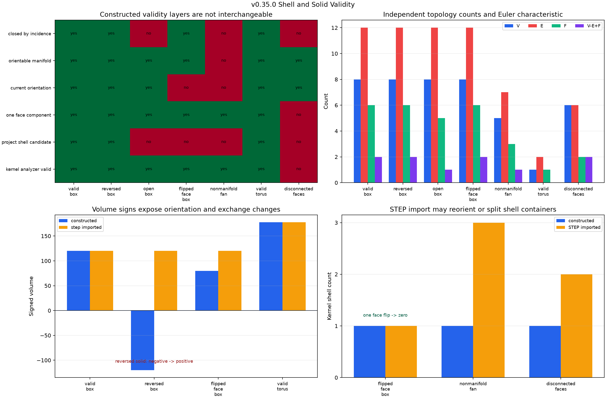

# Shell and Solid Validity: Incidence, Orientation, Euler, and Volume Contracts

## 日本語概要

本ノートは、正常な直方体・反転直方体・開いた直方体外殻・1面反転外殻・非多様体三角形群・トーラス・非連結面群を合成し、辺の使用回数、面の連結成分、閉包、向き付け可能性、現在の向き、オイラー標数、符号付き体積を独立に調べ、形状計算核の一般妥当性判定および外殻専用判定と比較します。14件の構築時・STEP再読込時観測すべてで制御した位相値を保持しましたが、一般妥当性が真でも開放・向き不正・非多様体を許す場合があり、STEP往復は反転立体の体積符号、1面反転、外殻のまとまり方を変えました。英語本文で実験、解釈、限界、次の疑問を説明します。

---

## English Summary

Seven synthetic controls separate edge incidence, face connectivity, closure,
orientability, current orientation, Euler characteristic, signed volume, and
backend validity before and after STEP exchange. All 14 stage observations
retain the controlled V/E/F, component, incidence, and Euler values. Generic
backend validity nevertheless returns true for an open shell, a closed shell
with one reversed face, and a nonmanifold fan. STEP import also normalizes or
regroups some topology. The result is a layered validity contract, not a
general CAD-quality threshold or repair system.

## Research Question

Can shell and solid validity be evaluated as explicit, reproducible claims
rather than collapsed into one backend boolean?

More specifically:

- Does every unique edge have the controlled number of oriented face uses?
- How many face-connected components exist?
- Is the boundary closed by incidence?
- Can relative face orientations be made consistent, and are they consistent
  now?
- Does `V - E + F` match the controlled Euler characteristic?
- Is signed volume used only when its topological preconditions hold?
- Which observations change after STEP write and re-import?
- How do independent checks compare with generic and shell-specific backend
  reports?

## Background

STEP distinguishes topology roles rather than defining validity as one flag.
The public STEP reference describes a
[`closed_shell`](https://www.steptools.com/stds/stp_aim/html/t_closed_shell.html)
as a connected face set used to enclose a finite volume. A
[`manifold_solid_brep`](https://www.steptools.com/stds/stp_aim/html/t_manifold_solid_brep.html)
references a closed outer shell; the advanced B-Rep module also separates an
outer shell from optional, oppositely oriented void shells in its
[`manifold_solid_brep` information requirements](https://steptools.com/stds/smrl/data/modules/advanced_boundary_representation/sys/4_info_reqs.htm).

The selected backend exposes several checks with different meanings.
[`BRepCheck_Analyzer`](https://dev.opencascade.org/doc/refman/html/class_b_rep_check___analyzer.html)
evaluates whether a shape and its subshapes satisfy Open CASCADE validity
criteria. The more specific
[`BRepCheck_Shell`](https://dev.opencascade.org/doc/refman/html/class_b_rep_check___shell.html)
separately reports whether oriented faces close a shell and whether their
orientations are correct. `BRepCheck_Analyzer.IsValid()` is therefore recorded
as one observation, not promoted into the project's definition of a closed,
oriented shell.

The experiment uses four deliberately separate concepts:

1. **Incidence closure.** One face-boundary use denotes a boundary edge, two
   uses denote the controlled manifold pair, and more than two uses denote a
   nonmanifold edge in this corpus.
2. **Orientability.** Pairwise edge constraints are solved as a parity graph.
   An edge used twice requires the two effective traversal directions to be
   opposite. A consistent assignment proves only that this controlled graph
   can be oriented; it does not prove the faces are currently oriented that
   way.
3. **Euler characteristic.** `V - E + F` is compared with independently known
   topology. The box controls have value `2`; the open box and nonmanifold fan
   have value `1`; the one-face torus has value `0`; and two disconnected
   triangular disks sum to `2`. Matching this invariant is necessary evidence,
   not a complete validity proof.
4. **Volume eligibility.** Exact backend volume is compared with the analytic
   magnitude only for a single face component that is closed, edge-manifold,
   orientable, and currently orientation-consistent. This follows the warning
   in
   [`BRepGProp::VolumeProperties`](https://dev.opencascade.org/doc/refman/html/class_b_rep_g_prop.html):
   free boundaries or incoherent orientation can make the result false even
   though the routine returns a number.

## Method

The independent implementation maps analysis-local vertices, edges, and faces
for each whole control shape. It then:

1. enumerates every oriented edge occurrence under every face;
2. counts unique incident faces separately from oriented occurrences, so a
   periodic seam can be used twice by one face;
3. builds face adjacency through shared topological edges;
4. extracts connected face components;
5. classifies one-use boundary edges, two-use pairs, and greater-than-two-use
   nonmanifold edges;
6. solves relative face-orientation parity and reports the minimum number of
   face flips, allowing a component-wide reversal as equivalent;
7. computes global and per-component Euler characteristics;
8. admits analytic volume comparison only after the declared topology and
   orientation gates pass; and
9. records generic analyzer status, per-shell closure and orientation status,
   and per-solid minimum status separately.

Each control is generated in memory, measured, written as its own STEP file,
normalized only for known writer timestamps and counters, read back, and
measured again. The generated fixtures use fixed dimensions and contain no
external or private data.

## Controlled Experiment

| Control | Independent topology truth | Intended boundary |
| --- | --- | --- |
| `valid_box` | `V=8, E=12, F=6, χ=2`, closed, volume `120` | Positive genus-zero solid control |
| `reversed_box` | Same counts and magnitude `120`; whole shape reversed | Relative face consistency versus global volume sign |
| `open_box` | `V=8, E=12, F=5, χ=1`, four boundary edges | Open but orientable shell |
| `flipped_face_box` | `V=8, E=12, F=6, χ=2`, no boundary; one face flip required | Incidence closure without current orientation consistency |
| `nonmanifold_fan` | `V=5, E=7, F=3, χ=1`; one edge used by three faces | Edge-nonmanifold condition |
| `valid_torus` | `V=1, E=2, F=1, χ=0`, closed, volume `18π²` | Genus-one solid and two self-seam edge pairs |
| `disconnected_faces` | `V=6, E=6, F=2, χ=2`; two face components | Container membership versus connectivity |

Run the experiment from the repository root:

```bash
python -m pip install -e ".[geometry]"
python experiments/run_shell_solid_validity.py
```

The command writes whole-shape observations, edge incidence, connected
components, per-shell backend reports, a compact summary, a versioned JSON
contract, seven STEP fixtures, and two figures.

## Results

All 14 constructed and STEP-imported observations matched the controlled
vertex, edge, face, face-component, boundary-edge, nonmanifold-edge, closure,
orientability, and Euler values.

| Control | Constructed finding | STEP-imported finding |
| --- | --- | --- |
| `valid_box` | Closed, current orientation consistent, analyzer valid, signed volume `+120` | Same topology and signed volume |
| `reversed_box` | Closed and relatively consistent, analyzer valid, signed volume `-120` | Same magnitude, but signed volume normalized to `+120` |
| `open_box` | Four boundary edges; analyzer valid; shell status `BRepCheck_NotClosed`; raw volume `96` rejected by the project gate | Same topology and statuses |
| `flipped_face_box` | Incidence-closed and orientable, but one flip is required; analyzer valid; shell orientation status `BRepCheck_BadOrientationOfSubshape`; raw volume `80` rejected | Current orientation becomes consistent, required flips become zero, and eligible volume becomes `+120` |
| `nonmanifold_fan` | One edge has three uses; analyzer valid; shell status `BRepCheck_InvalidMultiConnexity` | Global three-use edge remains, but one shell container becomes three open shells |
| `valid_torus` | `χ=0`; each of two edges is used twice by the same face; exact volume equals `18π²` | Same topology; volume-magnitude error `6.37e-12` |
| `disconnected_faces` | Two face components inside one shell; analyzer false; shell status `BRepCheck_NotConnected` | Two components remain, but import creates two open shells and the generic analyzer becomes true |

At both stages, three controls have `kernel_analyzer_valid=true` while failing
the project's closed-oriented-shell candidate contract. This count is not a
kernel defect count: it demonstrates that the generic predicate answers a
different question.



The generated shape preview makes the omitted face, reversed face,
three-face shared edge, torus genus, and disconnected components visually
inspectable.


## Interpretation

### Generic validity is not closed-solid validity

The open box, misoriented closed shell, and nonmanifold fan all return true
from the generic analyzer in the constructed stage. Their shell-specific
reports and independent incidence evidence still distinguish the relevant
conditions. Callers must state whether they require a valid face set, a closed
shell, a consistently oriented shell, or a solid enclosing material.

### Closure, orientability, and current orientation are different

The one-face-flipped box has two uses per edge and Euler characteristic `2`, so
it is incidence-closed. Its parity constraints are solvable, so it is
orientable. It is not currently oriented consistently, and the independent
minimum is one face flip. A whole-solid reversal needs zero relative face
flips yet changes the signed volume from positive to negative. Relative and
global orientation must therefore remain separate fields.

### STEP round trips may normalize rather than preserve representation

The controlled writer and reader retain all global topology invariants, but
they change three representation details: the reversed solid's volume sign is
made positive, the individually flipped face is reoriented, and invalid or
disconnected shell containers are split. A successful read and matching
V/E/F counts do not prove that original shell grouping or orientation survived.

### Euler characteristic is useful but intentionally weak

The valid box and the disconnected pair of triangular disks both have global
Euler characteristic `2`; only the component and boundary checks distinguish
them. The valid torus is closed with Euler characteristic `0`, showing why
`χ=2` cannot be a universal closed-solid rule. Euler evidence is most useful
when compared with a known construction or interpreted with connectedness and
genus.

### Numeric volume is not automatically meaningful

The open box produces `96` and the one-face-flipped box produces `80`, but
neither number is accepted. They violate the preconditions documented for
volume-property evaluation. Returning a finite numeric result is not evidence
that the shape encloses a coherent volume.

## Failure Modes

- Treating `BRepCheck_Analyzer.IsValid()` as proof that a shell is closed,
  manifold, consistently oriented, or suitable for volume evaluation.
- Counting incident faces instead of oriented edge occurrences; a valid
  one-face torus uses each seam edge twice on the same face.
- Treating two uses per edge as a complete manifold proof; vertex
  neighborhoods and geometric self-intersections require additional checks.
- Treating incidence closure as current orientation correctness.
- Assuming `V - E + F = 2` for every closed solid or interpreting a matching
  Euler value without component and boundary evidence.
- Reporting a raw volume from an open or incoherently oriented shell as a
  physical result.
- Assuming a STEP round trip preserves shell containers, face orientation,
  local indices, or signed-volume convention merely because it succeeds.
- Calling translator normalization a repair of design intent without an
  explicit original-to-imported change record.

## Practical Guidance

For a bounded shell or solid inspection pipeline:

1. Preserve the source STEP bytes and identify the processing stage.
2. Record analysis-local V/E/F and shell/solid counts.
3. Count oriented edge uses and unique incident faces separately.
4. Report connected face components, boundary edges, and greater-than-two-use
   edges before asking for volume.
5. Separate orientability from the current face orientations and from global
   inward/outward sign.
6. Use Euler characteristic as a regression invariant beside, not instead of,
   incidence and component checks.
7. Gate volume on declared topology and orientation preconditions and retain
   both signed value and magnitude error.
8. Keep generic analyzer results and specific shell statuses as independent
   columns.
9. Compare pre-exchange and post-import evidence; report reorientation or
   shell splitting explicitly.
10. Defer sewing or healing until an operation log and original-versus-repaired
    contract exist.

## Limitations

- The corpus contains seven small synthetic analytic controls evaluated with
  one pinned `cadquery-ocp`/OCCT route on the Linux x64 reference environment.
- The incidence rule detects boundary and greater-than-two-use edges, but it
  does not establish manifold vertex neighborhoods, embeddedness, or absence
  of shell self-intersection.
- The parity solver establishes orientability only for the extracted
  face-edge graph. It does not select a physical material side for arbitrary
  nested shells.
- Only a box and ring torus have independent analytic volume truth. No void
  shell, nested shell, self-intersecting shell, spline face, or tolerance-gap
  volume is evaluated.
- The imported topology is matched by control file, not by persistent
  original-to-imported face identity.
- STEP entity names and shell grouping are recorded for the generated files;
  the study does not claim complete AP242 validation or arbitrary-writer
  behavior.
- The experiment performs no sewing, healing, orientation repair, tolerance
  change, tessellation contract, or arbitrary-file security isolation.
- Numeric regression limits are fixture-specific and are not manufacturing or
  universal CAD-quality thresholds.

## Questions Carried Forward

- When a translator reorients faces or splits an invalid shell container,
  should the tool label that change normalization, repair, or semantic drift?
- Which stable correspondence can relate original and imported faces after
  reorientation or shell regrouping without pretending local indices persist?
- How should vertex-neighborhood manifoldness and geometric shell
  self-intersection be checked independently of one shape kernel?
- What is the minimum audit record required before sewing or healing can be
  exposed as an explicit operation in v0.36.0?

## Sources

- [Open CASCADE `BRepCheck_Analyzer` class reference](https://dev.opencascade.org/doc/refman/html/class_b_rep_check___analyzer.html)
- [Open CASCADE `BRepCheck_Shell` class reference](https://dev.opencascade.org/doc/refman/html/class_b_rep_check___shell.html)
- [Open CASCADE `BRepCheck_Solid` class reference](https://dev.opencascade.org/doc/refman/html/class_b_rep_check___solid.html)
- [Open CASCADE `BRepGProp` class reference](https://dev.opencascade.org/doc/refman/html/class_b_rep_g_prop.html)
- [Open CASCADE `BRepLib::OrientClosedSolid` reference](https://dev.opencascade.org/doc/refman/html/class_b_rep_lib.html)
- [STEP Tools `closed_shell` reference](https://www.steptools.com/stds/stp_aim/html/t_closed_shell.html)
- [STEP Tools `manifold_solid_brep` reference](https://www.steptools.com/stds/stp_aim/html/t_manifold_solid_brep.html)
- [STEP advanced boundary representation information requirements](https://steptools.com/stds/smrl/data/modules/advanced_boundary_representation/sys/4_info_reqs.htm)
