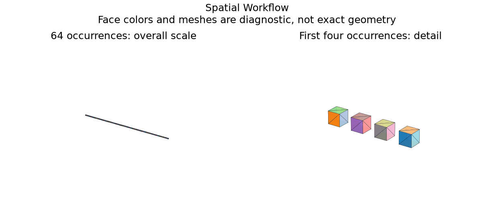

# Staged STEP and Spatial Indexing

## 日本語概要

v0.73.0では段階的STEP処理・空間索引・遅延評価を実装し、7件の限定した合成条件を検証しました。入力・判断根拠・結果をCSV、JSON、図、再生成可能なサンプルに残しています。

検証範囲と失敗例は以下の英語本文に示します。一般のCADデータへの適用や完全な規格適合を主張するものではありません。

---

## English Summary

Byte acquisition precedes source-preserving syntax parsing. Budgets cover bytes, tokens, entities, heuristic memory, cooperative elapsed time, geometry count, topology count and candidate pairs. Rigid box bounds are exact from authored sizes and placements. The median-split BVH is a broad phase; candidates still require narrow-phase checks. The reference is a bounded scaling control, not an industrial-size benchmark, streaming parser, measured memory cap or native security boundary.

## Results and Interpretation

Seven controls exercise a 64-solid STEP, a 128-occurrence authored-box BVH, 127 clearance candidates, cache reuse, partial pair enumeration, and byte/entity/memory-estimate refusals. Candidate search builds no native shape until geometry is requested.

The 7 `checks_pass` observations check the declared expectation, including
expected rejections and recorded learning failures. They do not mean that every
input was accepted or every learned prediction was correct.

## Sources and Implementation Boundary

The implementation reuses the repository Part 21 parser and its admission limits. Index correctness is checked against a brute-force pair enumeration, including rotated-bound validation in the API.

- 64-solid STEP and 128-occurrence index are bounded scale controls, not industrial-size throughput claims
- byte stage precedes syntax; geometry remains deferred; memory is an estimate and time checks are cooperative
- exact authored-box BVH supports rigid placements; lazy native geometry and pair limits; no native-code sandbox

## Reproduction and Artifacts

Run from the repository root in the pinned geometry environment:

```bash
python experiments/run_spatial_workflow.py
```

Default runs verify fixture bytes. To regenerate into separate directories:

```bash
python experiments/run_spatial_workflow.py --output-dir output/spatial-workflow --fixture-dir output/fixtures/spatial-workflow --refresh-fixtures
```

- [Observations](../results/spatial_workflow.csv)
- [Detailed evidence](../results/spatial_workflow_evidence.json)
- [Contract and limits](../results/spatial_workflow_contract.json)
- [Fixture manifest](../fixtures/spatial-workflow/manifest.csv)
- [Experiment](../experiments/run_spatial_workflow.py)
- [Implementation](../src/research_notes/engineering_studies.py)


