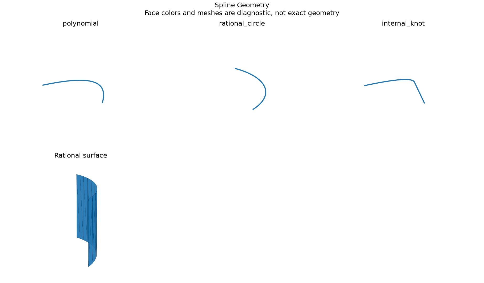

# B-Spline and NURBS Geometry

## 日本語概要

v0.67.0ではBスプライン・NURBSの曲線と曲面を実装し、4件の限定した合成条件を検証しました。入力・判断根拠・結果をCSV、JSON、図、再生成可能なサンプルに残しています。

検証範囲と失敗例は以下の英語本文に示します。一般のCADデータへの適用や完全な規格適合を主張するものではありません。

---

## English Summary

An independent Cox-de Boor basis and homogeneous quotient derivative evaluate clamped degree-1-to-5 curves with at most 64 poles. Positive weights, finite coordinates, strictly ordered distinct knots and consistent multiplicities are checked before native construction. Periodicity is recorded but periodic evaluation is explicitly rejected. Exported/imported poles, knots, weights and degrees remain inspectable; general reparameterization invariance is not assumed.

## Results and Interpretation

Polynomial, rational quarter-circle, internal-knot and rational quarter-cylinder controls compare positions, first derivatives and STEP exchange samples. The rational curve stays on a radius-2 circle; the surface agrees with an independent tensor-product extrusion.

The 4 `checks_pass` observations check the declared expectation, including
expected rejections and recorded learning failures. They do not mean that every
input was accepted or every learned prediction was correct.

## Sources and Implementation Boundary

The [OCCT B-spline curve reference](https://occt3d.com/dev/doc/refman/html/class_geom___b_spline_curve.html) describes the native representation. Runtime overloads were checked in pinned OCP 7.9.3.1.1; the online manual may describe a newer OCCT release.

- clamped nonperiodic degree 1..5, at most 64 curve poles; positive weights and bounded coordinates
- periodicity is recorded on exchange; periodic evaluation is explicitly unsupported
- independent curve basis and quarter-cylinder truth; same-parameter exchange observations do not imply universal parameter preservation

## Reproduction and Artifacts

Run from the repository root in the pinned geometry environment:

```bash
python experiments/run_spline_geometry.py
```

Default runs verify fixture bytes. To regenerate into separate directories:

```bash
python experiments/run_spline_geometry.py --output-dir output/spline-geometry --fixture-dir output/fixtures/spline-geometry --refresh-fixtures
```

- [Observations](../results/spline_geometry.csv)
- [Detailed evidence](../results/spline_geometry_evidence.json)
- [Contract and limits](../results/spline_geometry_contract.json)
- [Fixture manifest](../fixtures/spline-geometry/manifest.csv)
- [Experiment](../experiments/run_spline_geometry.py)
- [Implementation](../src/research_notes/advanced_geometry_studies.py)


