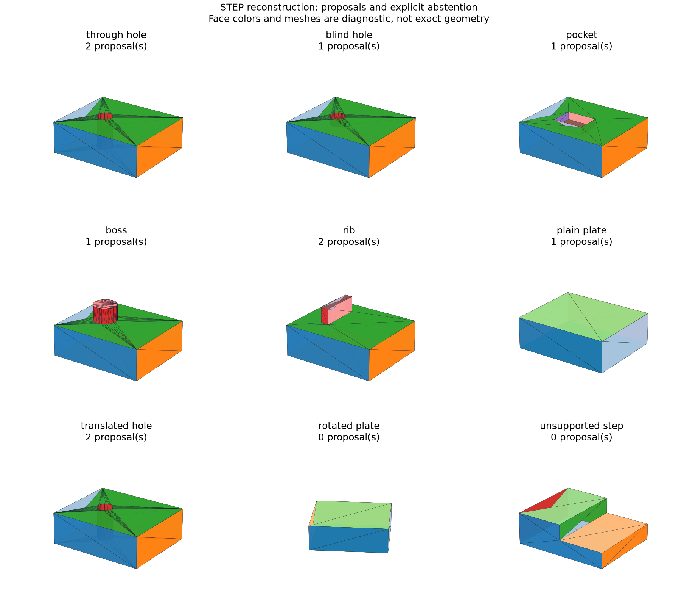

# STEP-to-Feature Reconstruction Candidates

## 日本語概要

v0.59.0では、STEPから測定した平面・円筒面・頂点と形状全体の残差を使って、編集可能な特徴グラフの候補を生成します。9入力から10候補が得られ、3入力は複数候補、4入力は単独候補、2入力は対応外です。候補には元データのハッシュ、局所的な面番号、残差、未校正の適合度を記録し、利用者が選ぶまでは未確認とします。元のCAD履歴や設計意図の復元は主張しません。詳細は英語本文に示します。

---

## English Summary

Nine STEP controls yield ten editable reconstruction candidates: three
ambiguous sources, four sources with one candidate, and two unsupported
sources. Inference uses measured B-Rep evidence rather than fixture names or
construction truth. Every candidate remains explicitly unconfirmed.

## Research Question and Sources

Can a small candidate grammar explain a final boundary while exposing
equivalent constructions and unsupported inputs?

The [v0.57.0 feature study](parametric-holes-pockets-bosses-ribs.md) supplies
the construction grammar; the [v0.58.0 DAG](dependency-graph-deterministic-recompute.md)
provides editable parameter graphs. The earlier
[roadmap](../docs/brep-learning-roadmap.md) distinguishes reconstruction from
unavailable authoring history. OCCT's
[Boolean operations](https://occt3d.com/dev/doc/refman/html/class_b_rep_algo_a_p_i___fuse.html)
provide same-kernel material-difference diagnostics, not an independent proof.

## Input and Inference Contract

The importer reads at most 2,000,000 bytes plus one overflow byte into a single
snapshot. Part 21 parsing uses declared limits. External references are
rejected without retrieval. Exactly one SI millimetre length unit and one
global unit context are required, and shape representations must reference
that qualified context. Native transfer must return one root, one valid solid,
one shell, and at most 24 faces.

Qualified geometry has axis-aligned planar supports and at most one cylinder
parallel to Z. World translation is retained. Vertices, support axes, cylinder
radii, and face extents propose plate dimensions and a single internal hole,
pocket, or protrusion. Candidate parameters are rounded to nine decimal places
then tested against the unrounded imported geometry.

Each proposal is regenerated by the DAG and tested for:

- volume residual at most 1e-7 mm³;
- surface-area residual at most 1e-7 mm²;
- bidirectional Boolean difference volume at most 1e-7 mm³;
- maximum bounding-coordinate residual at most 1e-7 mm;
- equal topology counts and support-surface inventories.

The fit score is `1 / (1 + max(residuals) / 1e-7)` for this fixed-unit
contract. It is labelled `uncalibrated_geometric_fit`, not a probability of
correct history or a scale-independent confidence measure. Accepted candidates
record source SHA-256, graph parameters, residuals, explanation, and local
supporting face indices. These indices do not establish persistent identity
or direct Part 21 entity correspondence.

## Results

| Input | Candidates | Decision |
| --- | ---: | --- |
| Through hole | 2 | Boolean cut or extrusion with inner profile |
| Blind hole | 1 | Unconfirmed blind-hole proposal |
| Pocket | 1 | Unconfirmed rectangular-pocket proposal |
| Cylindrical boss | 1 | Unconfirmed boss proposal |
| Rib | 2 | Rectangular rib or rectangular boss label |
| Plain plate | 1 | Unconfirmed plate extrusion |
| Translated hole | 2 | Both hole routes retain translation |
| Rotated plate | 0 | Unsupported orientation |
| Exterior step | 0 | No proposal passes the fit gate |



The two hole routes execute different constructions with matching final
geometry. Rib/boss alternatives use the same rectangular protrusion with
different semantic explanations. Neither ambiguity is resolved from the
boundary. Tests rename a STEP and place false construction labels beside it;
inference remains bound to its geometry and source bytes.

## Reproduction and Evidence

```bash
python experiments/run_parametric_features.py
python experiments/run_step_reconstruction.py
python -m pytest -q tests/test_step_reconstruction.py
```

- [Input manifest](../fixtures/step-reconstruction/manifest.csv) and [evaluation truth](../fixtures/step-reconstruction/controls.json)
- [Source outcomes](../results/step_reconstruction.csv) and [candidate residuals](../results/reconstruction_candidates.csv)
- [Full evidence and graphs](../results/step_reconstruction.json) and [contract](../results/step_reconstruction_contract.json)
- [Implementation](../src/research_notes/step_reconstruction.py) and [experiment](../experiments/run_step_reconstruction.py)

The evaluation runner reads expected explanations only to score results;
the inference function does not read the truth file.

## Limitations and Next Question

Fixed thresholds qualify these small millimetre controls. They do not establish
arbitrary geometry, rotated features, multiple interacting operations,
cross-kernel equivalence, calibrated confidence, manufacturing intent, or
recovery of original sketches, constraints, operation order, or names.
The native importer is in-process, without an OS sandbox or native timeout;
parser and file-size limits do not bound native runtime or memory.
The next study requires explicit selection before editing or exporting a
candidate-based model.
