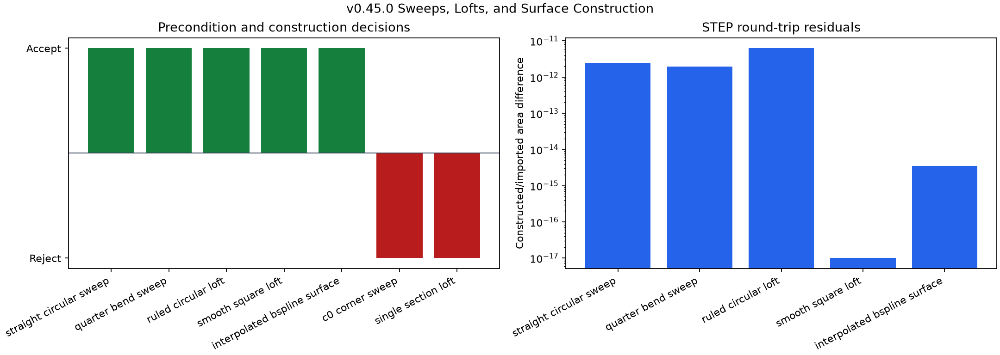
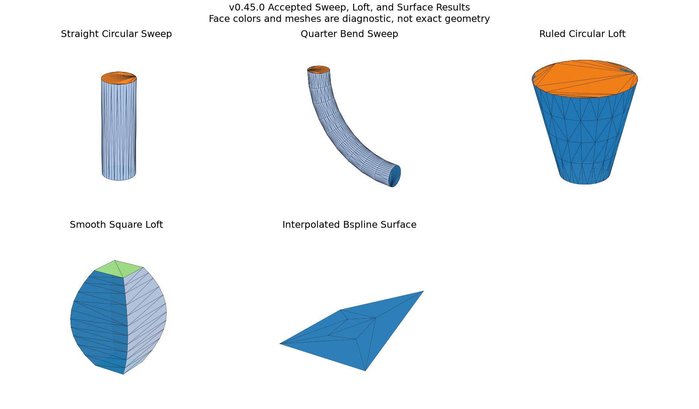

# Sweeps, Lofts, and Surface Construction

## 日本語概要

本ノートは、輪郭を経路に沿わせる掃引、複数断面をつなぐロフト、点格子から作るBスプライン面を、合成入力で検証します。正常な5条件は構築直後とSTEP再読込後に有効性・位相・曲面・測定値を比較し、独立に真値を計算できる3形状は体積と表面積も検証しました。折れた経路と断面不足は計算核を呼ぶ前に理由付きで拒否します。滑らかなロフトが入力断面の最大幅を約1.5倍まで超えたため、断面通過と断面包絡内への収まりは別の性質だと示します。詳細は英語本文に示します。

---

## English Summary

This study evaluates two pipe sweeps, two section lofts, and one point-grid
B-spline surface under a pinned geometry backend. It separates declared input
preconditions from native construction status, checks five accepted shapes
before and after STEP exchange, and records two rejected controls without
invoking the kernel. Three accepted solids also have independent analytic
volume and area truth.

## Research Question

Which bounded sweep, loft, and surface-construction claims remain reproducible
when construction inputs, admission rules, kernel observations, and STEP
round-trip measurements are recorded separately?

## Background

A sweep transports a profile along a spine. Open CASCADE documents that
`BRepOffsetAPI_MakePipe` requires a G1-continuous spine: tangent directions on
both sides of a connection vertex must agree. A loft instead passes a shell or
solid through an ordered sequence of wire sections. A point-grid surface fits
or interpolates a B-spline support from sampled points. These operations create
evaluated B-Rep geometry; they do not provide a portable sketch or feature
history in a STEP boundary representation.

## Method

The fixed catalog contains seven controls:

| Control | Construction input | Expected route |
| --- | --- | --- |
| `straight_circular_sweep` | Radius-1 disk and length-6 straight spine | accept |
| `quarter_bend_sweep` | Radius-0.6 disk and radius-5 quarter-circle spine | accept |
| `ruled_circular_loft` | Radius-1 and radius-2 circles separated by 4 | accept |
| `smooth_square_loft` | Square half-spans 1, 2, 1 at heights 0, 3, 6 | accept |
| `interpolated_bspline_surface` | Deterministic 4-by-4 point grid | accept |
| `c0_corner_sweep` | Two line segments meeting at a right angle | reject: `spine_not_g1` |
| `single_section_loft` | One circular section | reject: `insufficient_sections` |

The two negative controls stop at the project admission boundary. Their rows
record `kernel_invoked=0`; native failure behavior is deliberately not treated
as the contract.

## Controlled Experiment

For each accepted control, the experiment:

1. constructs a shape with the pinned Open CASCADE binding;
2. records builder status and, for pipes, `ErrorOnSurface`;
3. measures topology, support-surface inventory, validity, volume, area,
   centroid, bounds, and maximum tolerances;
4. writes normalized STEP bytes, reads them back, and repeats the measurements;
5. compares the two stages at `1e-8` geometric tolerances;
6. compares the two sweeps and ruled circular loft with closed-form volume and
   area truth; and
7. records the smooth loft's radial bound relative to the largest input
   half-span.

Run the complete study with:

```bash
python experiments/run_sweep_loft_modeling.py
```

## Results

| Evidence | Observed result |
| --- | ---: |
| Controls | 7 |
| Accepted / rejected | 5 / 2 |
| Constructed / imported observations | 5 / 5 |
| Kernel-valid observations | 10 / 10 |
| Analytic volume and area matches | 6 / 6 stage observations |
| STEP round-trip contracts passed | 5 / 5 |
| Pipe `ErrorOnSurface` | `0` for both controls |
| Smooth-loft input-envelope ratio | approximately `1.5` |

The largest constructed/imported volume difference was below `7.3e-12`; the
largest area difference was below `6.3e-12`. The straight sweep produced a
cylindrical side, the bend produced a toroidal side, the ruled circular loft
produced a conical side, and the smooth square loft produced four B-spline
sides. The point-grid control retained one B-spline face.





## Interpretation

The bounded controls show that construction intent can be tested without
confusing it with the output B-Rep. Independent formulas validate the two
sweeps and ruled frustum, while the stage comparison tests exchange retention.
The smooth loft is valid and round-trips consistently, yet its bounds reach
about 1.5 times the largest declared section half-span. Passing through
sections therefore does not imply staying inside their simple envelope.

The negative controls also demonstrate an important boundary: a caller should
validate documented preconditions and produce a stable reason code rather than
depend on exceptions or version-specific recovery inside a native kernel.

## Failure Modes

- A C0 corner does not meet the documented G1 spine requirement for the chosen
  pipe constructor.
- One wire is insufficient to define a between-sections loft in this project
  contract.
- Smooth interpolation can overshoot the extents suggested by input sections.
- A valid B-Rep may still have undesirable fairness, curvature, thickness, or
  self-intersection properties not tested here.
- STEP import preserves evaluated geometry in these controls, not the original
  path, profile, section sequence, fitting grid, or command parameters.

## Practical Guidance

- Keep profile, spine, section, and fitting-point truth outside the result
  shape when repeatable recomputation matters.
- Check continuity and section-count requirements before entering the native
  construction routine.
- Measure the result against design envelopes; do not infer bounds from input
  sections alone.
- Record native status and approximation error as observations, not universal
  quality guarantees.
- Treat STEP exchange as an evaluated-geometry boundary unless a separate
  application protocol explicitly carries design intent.

## Limitations

The study uses two simple G1 spines, two aligned loft families, one small point
grid, and one pinned Open CASCADE binding. It does not test torsion-sensitive
frames, closed or self-intersecting spines, discontinuous profiles, section
compatibility repair, guide curves, fairness objectives, curvature continuity,
thickening, arbitrary trimming, cross-kernel behavior, or certified
approximation bounds. The B-spline control checks support type and exchange
measurements; it does not prove a maximum point-grid fitting error over the
entire surface.

## Sources

- [Open CASCADE `BRepOffsetAPI_MakePipe` reference](https://dev.opencascade.org/doc/refman/html/class_b_rep_offset_a_p_i___make_pipe.html)
- [Open CASCADE `BRepOffsetAPI_ThruSections` reference](https://dev.opencascade.org/doc/refman/html/class_b_rep_offset_a_p_i___thru_sections.html)
- [Open CASCADE `GeomAPI_PointsToBSplineSurface` reference](https://dev.opencascade.org/doc/refman/html/class_geom_a_p_i___points_to_b_spline_surface.html)
