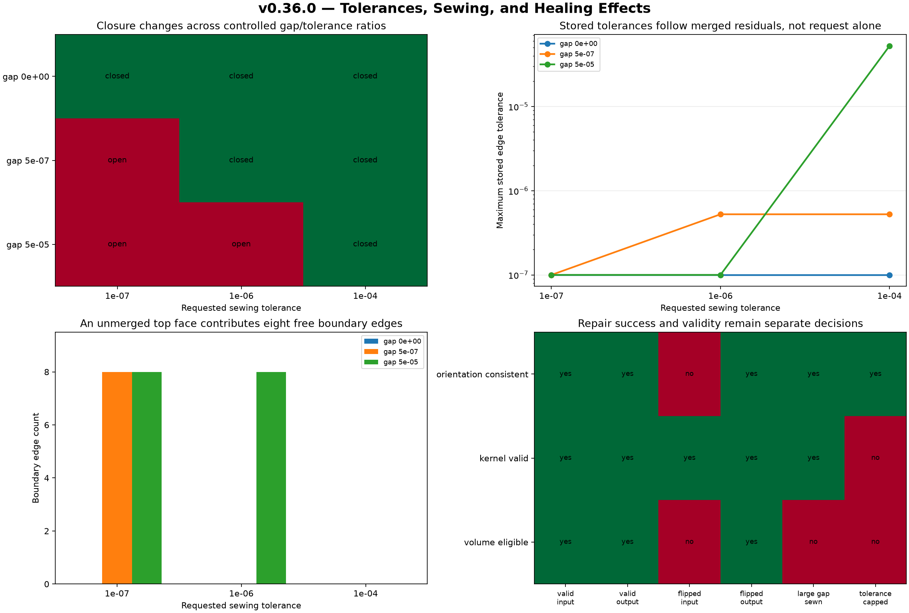

# Tolerances, Sewing, and Healing Effects: Controlled Gaps and Auditable Repair

## 日本語概要

本ノートは、4×5×6の直方体を構成する独立6面に隙間 `0`、`5e-7`、`5e-5` を与え、縫合許容差 `1e-7`、`1e-6`、`1e-4` の全9条件を比較します。隙間0は全条件、`5e-7` は `1e-6` 以上、`5e-5` は `1e-4` だけで閉じましたが、縫合は支持平面を移動せず、隙間を許容差で覆って位相的接続を作りました。1面反転外殻は面方向修復により必要反転数が1から0、符号付き体積が80から120へ変わり、正常外殻は無変更でした。さらに、縫合後の局所許容差を残差未満へ縮小すると位相を保ったまま妥当性判定が真から偽へ変化しました。したがって、縫合・修復・許容差変更は成功フラグではなく、入力、操作条件、位相差、局所許容差、幾何差、妥当性を分けた監査記録として扱います。詳細と限界は英語本文に示します。

---

## English Summary

Three synthetic six-face box controls cross three requested sewing tolerances.
The closure matrix is monotonic for this corpus: coincident boundaries close
at every request, a `5e-7` gap closes at `1e-6` and `1e-4`, and a `5e-5` gap
closes only at `1e-4`. Sewing changes shared topology and stored vertex/edge
tolerances while retaining all six controlled planar face areas, centroids,
and canonical support-plane equations.
A targeted shell-orientation repair is a no-op for the valid control and fixes
one reversed face in the positive control. Deliberately capping tolerances
below a sewn residual preserves topology but changes generic kernel validity
from true to false. These are operation-specific observations, not universal
CAD, manufacturing, or design-intent thresholds.

## Research Question

Can tolerance-mediated sewing and bounded shell repair be evaluated as
explicit transformations rather than reported as a single successful healing
result?

The study asks:

- At which side of controlled gap/tolerance relationships does sewing create
  shared topology?
- Which vertex, edge, and face tolerances are stored after each operation?
- Does sewing change the controlled support-face geometry or only its
  topological connectivity?
- Does a targeted orientation repair distinguish a valid no-op from one known
  reversed face?
- Can an apparently conservative tolerance reduction make a sewn shape
  invalid?
- Which numeric outputs remain inadmissible even after incidence closure?

## Background

OCCT's sewing guide distinguishes sewing from geometry-changing procedures.
Sewing connects separate topological elements when their geometry is close
enough under the configured tolerance; it does not fill a missing surface or
recover design intent. `BRepBuilderAPI_Sewing` exposes the requested tolerance,
free, contiguous, multiple, deleted, and degenerate-shape reports, plus modes
that affect how local tolerances and nonmanifold cases are handled.

Three different meanings of tolerance remain separate here:

1. **Requested sewing tolerance** is an algorithm parameter for one recorded
   operation.
2. **Stored B-Rep tolerance** is backend state on an analysis-local vertex,
   edge, or face after one stage.
3. **STEP representation uncertainty** is exchange-context information. It is
   not a per-subshape identity-preserved field or a semantic manufacturing
   tolerance.

OCCT documents the B-Rep nesting rule as
`Tol(Vertex) >= Tol(Edge) >= Tol(Face)` and cautions that tolerances should be
opened rather than arbitrarily restricted. `ShapeAnalysis_ShapeTolerance` can
inventory stored values, while `ShapeFix_ShapeTolerance` can modify them. This
study records the modification but does not treat it as beneficial merely
because the API call completes.

`ShapeFix_Shell::FixFaceOrientation` is selected instead of a broad default
healing pipeline. It answers the narrow controlled question of whether
neighboring face orientations need to change. Generic
`BRepCheck_Analyzer.IsValid()` remains an independent observation, as v0.35.0
already showed that generic validity is not equivalent to a closed oriented
shell contract.

## Method

### Independent construction truth

Every control uses six separately constructed planar rectangular faces for a
box with width `4`, depth `5`, and nominal height `6`. The independent total
face area is

`2 × (4×5 + 4×6 + 5×6) = 148`.

Only the top face is displaced for the two gap controls. The side faces retain
height `6`, so closing their top boundaries to the displaced top face requires
a tolerance envelope; the supporting planes do not geometrically coincide.

| Control | Top-face gap | Input topology |
| --- | ---: | --- |
| `coincident_box_faces` | `0` | Six disconnected faces |
| `small_gap_box_faces` | `5e-7` | Five box faces with coincident adjoining boundaries plus one displaced top face |
| `large_gap_box_faces` | `5e-5` | Five box faces with coincident adjoining boundaries plus one displaced top face |

Each control is sewn with requested tolerances `1e-7`, `1e-6`, and `1e-4`.
Local-tolerance accumulation and nonmanifold sewing are explicitly disabled;
same-parameter processing is enabled. A fresh construction is used for every
matrix cell.

### Stage observations

Each source and result records:

- V/E/F, shell, solid, and face-component counts;
- one-use boundary, two-use manifold-pair, and greater-than-two-use edge
  counts;
- incidence closure, orientability, current orientation, and minimum face
  flips;
- generic backend validity;
- every analysis-local vertex, edge, and face tolerance, plus type-level
  minimum, mean, and maximum;
- total surface area and a permutation-independent comparison of all six face
  areas, centroids, and canonical support-plane normals and offsets with the
  constructed control;
- raw signed volume and a separate eligibility gate; and
- parent observation, exact operation parameters, backend reports, observed
  changes, and a bounded decision.

Analysis-local indices enumerate one stage only. They are not asserted to be
persistent identities across merging or repair.

### Orientation and tolerance-change controls

Two connected shells isolate orientation repair:

- `valid_box_shell` is the negative control and should require no change.
- `flipped_face_box_shell` has one known reversed face and should require one
  relative face flip.

The experiment invokes only `ShapeFix_Shell::FixFaceOrientation` with
multiconnected-case accounting enabled and nonmanifold output disabled.

The negative tolerance control starts from the `5e-5` gap sewn at `1e-4`. It
then calls `ShapeFix_ShapeTolerance::LimitTolerance` with maximum `1e-5`, below
the stored residual needed by the sewn representation. The output is measured
whether or not the operation appears conservative by numeric magnitude.

### Retained STEP samples

Ten normalized STEP files preserve the three inputs, selected sewn outputs,
orientation input and output, the valid orientation input, and the rejected
tolerance-capped output. The manifest records SHA-256, byte size, backend and
STEP processor versions, writer/reader status, STEP entity counts, and
re-imported topology.

STEP is an exchange sample here, not a byte-for-byte serialization of all
in-memory OCCT tolerance and repair state. Re-import is measured separately.

## Controlled Experiment

Install the optional geometry dependency and run:

```bash
python -m pip install -e ".[geometry,test]"
python experiments/run_tolerance_sewing_healing.py
python -m pytest tests/test_tolerance_sewing_healing.py
```

To reproduce the committed STEP samples themselves:

```bash
python experiments/run_tolerance_sewing_healing.py \
  --fixture-dir fixtures/tolerance-sewing-healing \
  --refresh-fixtures
```

All geometry is generated by the script. No external, production, employer,
customer, or private CAD model is used.

## Results

The study produced 17 stage observations, 550 analysis-local tolerance rows,
12 operation records, 10 STEP samples, a versioned JSON contract, and two
figures.

### Sewing boundary

| Controlled gap | Requested `1e-7` | Requested `1e-6` | Requested `1e-4` |
| ---: | --- | --- | --- |
| `0` | Closed | Closed | Closed |
| `5e-7` | Open | Closed | Closed |
| `5e-5` | Open | Open | Closed |

Every unsewn source has `V=24, E=24, F=6`, six face components, and 24
boundary edges. When the side/bottom group is sewn but the top remains
separate, the result has `V=12, E=16, F=6`, two face components, and eight
boundary edges. A fully sewn matrix result has `V=8, E=12, F=6`, one face
component, and no boundary edges.

The generic analyzer returns true for the unsewn and partially sewn shapes as
well as for the fully sewn shapes. It therefore remains unsuitable as a
stand-alone closure test.

### Stored tolerances and geometry

The first closed `5e-7` control has maximum stored vertex and edge tolerances
`5.249999996070897e-7`. The closed `5e-5` control has maxima
`5.249999999987765e-5`. Tests assert only the controlled relative relations,
not these backend-specific exact values.

All 17 observations retain the six controlled face areas, centroids, and
canonical support-plane equations within `1e-12`, and every total surface area
remains `148`. The operation thus changes connectivity and stored tolerance for
this corpus without moving the known support planes. Nevertheless, a nonzero
physical gap remains encoded between the top and side supporting planes.

The raw boundary-integral volume is `120.00000333333334` for the `5e-7` gap
and `120.00033333333333` for the `5e-5` gap. Neither is admitted to the volume
contract, even after topology becomes incidence-closed. Only zero-gap,
closed, orientable, currently consistent controls are eligible; all six
eligible observations have zero volume-magnitude error against `120`.

### Orientation repair and invalidating tolerance cap

| Control | Before | After |
| --- | --- | --- |
| Valid shell | Minimum flips `0`, signed volume `120` | No modification; same values |
| One reversed face | Minimum flips `1`, signed volume `80` | Minimum flips `0`, signed volume `120` |
| `5e-5` gap sewn at `1e-4`, then capped | Closed and analyzer-valid; max edge tolerance about `5.25e-5` | Same V/E/F and closure, max edge tolerance `1e-5`, analyzer-invalid |

The capped shape demonstrates that a lower stored tolerance can contradict the
geometric residual represented by an edge. The completed API call is recorded
as `rejected_invalid`, not described as a successful repair.

The capped STEP sample imports as analyzer-valid in this fixed route. STEP
write/read therefore does not preserve the invalid in-memory local-tolerance
state as a contract. This reinforces the need to retain stage provenance and
the original operation log beside exchange artifacts.



The shape figure deliberately exaggerates both nonzero gaps to make them
visible. It is an explanatory diagram, not a metric rendering.


## Interpretation

### Sewing creates connectivity under a tolerance policy

The matrix gives a controlled demonstration of a threshold effect without
claiming a universal threshold. The same geometric input stays open at one
request and becomes closed at a larger request. Closure means that the output
contains shared topology under the operation's tolerance model. It does not
mean the original support planes coincided or that a designer intended them
to be joined.

### Requested and stored tolerances answer different questions

The exact control retains approximately `1e-7` stored tolerances even when the
request is `1e-4`; the request is not copied blindly to every entity. Gap
controls increase selected vertex and edge tolerances according to the merged
residual. A useful report must therefore retain both the operation request and
the resulting per-subshape inventory.

### A repair needs both a positive and a no-op control

The valid shell returns no orientation modification, while the known reversed
face changes consistently with the independent parity result. This is stronger
evidence than showing only one input for which a fixer returns success.

The signed-volume change from `80` to `120` also shows why orientation repair
is semantically material even when V/E/F and all support faces remain fixed.

### Smaller tolerance is not automatically better

The cap negative control keeps topology closed but invalidates the B-Rep under
the backend's geometry-consistency checks. Tolerance is not merely a desired
accuracy label that can always be reduced. It records a bound needed to relate
topology and geometry in the representation.

## Failure Modes

- Calling sewing success proof that a gap was filled or that design intent was
  recovered.
- Treating a requested algorithm tolerance as every stored subshape tolerance.
- Confusing B-Rep tolerance, STEP representation uncertainty, and semantic
  geometric-dimensioning or manufacturing tolerance.
- Treating generic kernel validity as evidence that independent faces form a
  closed shell.
- Accepting a finite raw volume from noncoincident support geometry merely
  because tolerance-mediated topology is closed.
- Reducing tolerances without rechecking curve/surface consistency and whole-
  shape validity.
- Running broad default healing when a narrow diagnosed operation can be
  recorded instead.
- Reporting local indices as stable identities after edges or vertices merge.
- Assuming a STEP round trip preserves in-memory local tolerances or repair
  state.
- Choosing a universal sewing threshold from these model-unit regression
  controls.

## Practical Guidance

1. Preserve the original model and assign an immutable stage identifier.
2. Record model units, the requested tolerance, every enabled operation mode,
   and backend version.
3. Inventory V/E/F, components, free boundaries, orientations, and all local
   tolerances before and after the operation.
4. Compare known geometric anchors separately from topology. For arbitrary
   faces, introduce a defensible correspondence and residual method first.
5. Label nonzero-gap closure as tolerance-mediated and require application-
   specific review rather than silently accepting it.
6. Run both general validity and the specific closure/orientation checks needed
   by the consuming application.
7. Gate volume and downstream physical properties on explicit topology,
   orientation, and geometry-coherence preconditions.
8. Treat a no-op positive state as valuable regression evidence.
9. Never overwrite the source with a repaired result; retain both STEP samples
   and the operation log.
10. Re-import exported artifacts and report translator normalization as a new
    stage, not as proof that the original repair state persisted.

## Limitations

- Only axis-aligned planar faces of one 4×5×6 box are used.
- The sweep has three gaps and three requested tolerances in model units. It
  does not define manufacturing or arbitrary CAD acceptance limits.
- Geometry preservation is checked through six known planar face areas,
  centroids, and canonical support-plane equations; this is not a general
  boundary-curve, surface-distance, or persistent-identity algorithm.
- Only one face-orientation defect is repaired. There are no missing faces,
  self-intersections, small edges, duplicate faces, nonmanifold repairs,
  B-spline modifications, or nested void shells.
- `ShapeFix_Shell::FixFaceOrientation` is observed through one pinned
  `cadquery-ocp`/OCCT route. No independent kernel is compared.
- The tolerance cap is intentionally invalid and must not be used as a repair
  recommendation.
- STEP samples may normalize topology, orientation, or tolerance. They support
  visual and exchange inspection, not native-state identity.
- No untrusted arbitrary STEP input is admitted to the native-code path.
- The study does not recover sketches, parameters, feature history, or design
  intent.

## Questions Carried Forward

- Which application evidence should define an acceptable sewing-tolerance
  budget: model uncertainty, design requirements, manufacturing process, or a
  combination?
- Should every tolerance-mediated closure be quarantined until geometric
  residuals and units are reviewed?
- How should modified, split, and merged faces, edges, and vertices be related
  across stages without treating explorer indices as identities?
- Which independent proximity or intersection checks are needed before a
  closed-under-tolerance shell can be called geometrically coherent?
- How should orientation repair determine material side when outer and void
  shells are nested?

## Sources

- [OCCT Modeling Algorithms: Sewing](https://dev.opencascade.org/doc/occt-7.9.0/overview/html/occt_user_guides__modeling_algos.html)
- [OCCT `BRepBuilderAPI_Sewing` reference](https://dev.opencascade.org/doc/occt-7.9.0/refman/html/class_b_rep_builder_a_p_i___sewing.html)
- [OCCT Shape Healing guide](https://dev.opencascade.org/doc/occt-7.9.0/overview/html/occt_user_guides__shape_healing.html)
- [OCCT `ShapeFix_Shell` reference](https://dev.opencascade.org/doc/occt-7.9.0/refman/html/class_shape_fix___shell.html)
- [OCCT `ShapeFix_ShapeTolerance` reference](https://dev.opencascade.org/doc/occt-7.9.0/refman/html/class_shape_fix___shape_tolerance.html)
- [OCCT `ShapeAnalysis_ShapeTolerance` reference](https://dev.opencascade.org/doc/occt-7.9.0/refman/html/class_shape_analysis___shape_tolerance.html)
- [OCCT `BRep_Builder` reference](https://dev.opencascade.org/doc/occt-7.9.0/refman/html/class_b_rep___builder.html)
- [OCCT `BRepCheck_Analyzer` reference](https://dev.opencascade.org/doc/occt-7.9.0/refman/html/class_b_rep_check___analyzer.html)
- [STEP Tools `global_uncertainty_assigned_context` reference](https://www.steptools.com/stds/stp_aim/html/t_global_uncertainty_assigned_context.html)
- [STEP Tools `uncertainty_measure_with_unit` reference](https://www.steptools.com/stds/stp_aim/html/t_uncertainty_measure_with_unit.html)
