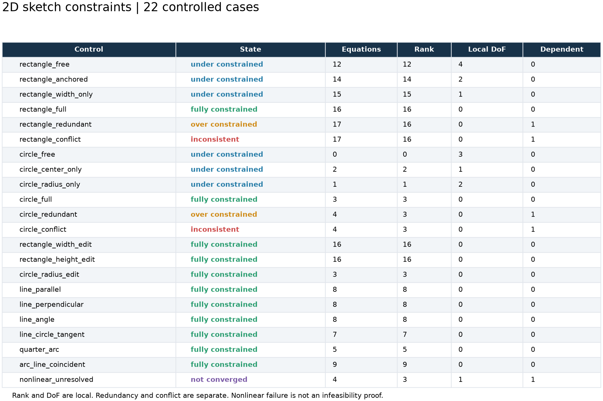
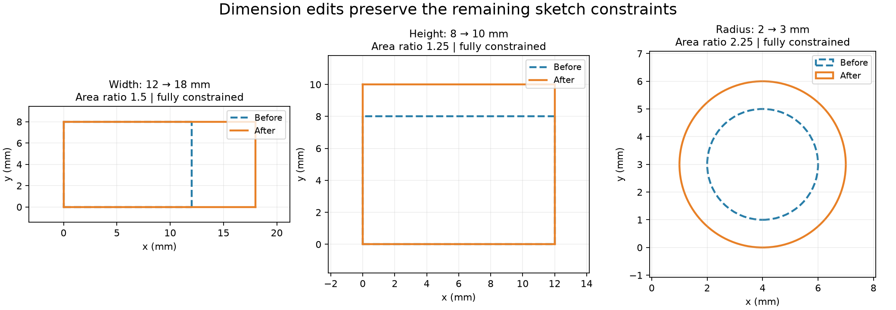

# Two-Dimensional Sketches and Geometric Constraints

## 日本語概要

v0.56.0は、長方形と円を中心に22個の小さな2Dスケッチを検証します。拘束不足・完全拘束・重複による過剰拘束・矛盾を区別し、数値計算の未収束は別の状態として記録します。長方形の自由度は、形状拘束のみの4から、原点固定で2、幅指定で1、高さ指定で0へ減少しました。

幅12→18 mm、高さ8→10 mm、円半径2→3 mmの変更後も残りの拘束を満たし、面積比はそれぞれ1.5、1.25、2.25です。平行・垂直・角度・直線と円の接線・円弧端点の一致も小さな例で確認します。一般的なCAD拘束ソルバー、STEP読込からの履歴復元、特徴グラフ全体の再計算は対象外です。詳細は英語本文に示します。

---

## English Summary

Twenty-two authored 2D sketches distinguish local freedom, satisfied redundant
constraints, affine inconsistency, and nonlinear non-convergence. Three scalar
dimension edits preserve the other constraints and match independent
coordinate and area truth. The solver remains separate from STEP modeling and
feature-graph recompute.

## Research Question

Can small authored sketches distinguish missing constraints, a fully determined
local solution, satisfied redundant equations, and incompatible dimensions,
while preserving unaffected geometry after an explicit dimension edit?

## Background

The [FreeCAD Sketcher dialog documentation](https://github.com/FreeCAD/FreeCAD-documentation/blob/main/wiki/Sketcher_Dialog.md)
distinguishes remaining degrees of freedom, redundant constraints, and
conflicting constraints. Those are useful separate observations: an extra
equation need not disagree with existing geometry, and a sketch can contain
both redundant equations and remaining freedom.

This study implements a small independent solver using
[NumPy least squares](https://numpy.org/doc/stable/reference/generated/numpy.linalg.lstsq.html)
and [singular value decomposition](https://numpy.org/doc/stable/reference/generated/numpy.linalg.svd.html).
It does not embed FreeCAD's solver or claim the same diagnostics.

## Representation and Supported Constraints

Each immutable sketch has an ID, revision, millimetre unit, explicit initial
geometry, identified constraints, and a deterministic input fingerprint.

| Entity | Scalar parameters | Named points |
| --- | --- | --- |
| Line | Two endpoint coordinates: 4 | `start`, `end` |
| Circle | Center coordinates and radius: 3 | `center` |
| Circular arc | Center coordinates, radius, start and end angles: 5 | `center`, evaluated `start` and `end` |

Point fixing, point coincidence, horizontal and vertical lines, signed x/y
dimensions, positive Euclidean distances, radii, parallel and perpendicular
lines, directed line angles, signed line-circle tangency, arc start angles,
and arc sweeps are supported. Arcs run counterclockwise with sweep strictly
between zero and `2π`; line-circle tangency concerns the infinite supporting
line and a full circle, not a contact on a finite segment or arc.

The rectangle consists of four independent lines. Four two-component
coincidence constraints close its corners; two horizontal and two vertical
constraints orient it. An origin constraint adds two equations, and width and
height add one signed coordinate-difference equation each. This makes the
expected rank progression independently countable.

## Method

Affine systems are solved directly by least squares. Nonlinear systems use
central-difference Jacobians and a backtracked Gauss-Newton step, starting from
the committed seed. No random restart or global solution search occurs.

At the final iterate, `n - rank(J)` records local freedom and
`m - rank(J)` records dependent equation rows, where `n` is the number of
scalar parameters and `m` is the number of scalar residual equations.
One point constraint can contribute two equations. Rank uses the cutoff
`1e-7 * max(1, largest singular value)`.

| State | Contract |
| --- | --- |
| `under_constrained` | Residual gate passes, no dependent rows, positive local freedom |
| `fully_constrained` | Residual gate passes, full column rank, no dependent rows |
| `over_constrained` | Residual gate passes with dependent rows; local freedom is reported separately |
| `inconsistent` | An affine least-squares system cannot meet the residual gate |
| `not_converged` | Nonlinear iteration stops without meeting the residual gate |
| `invalid_geometry` | Residuals pass but the result contains out-of-domain geometry, such as a collapsed line |

The residual gate is `1e-9` separately in mm, radians, or normalized directional
units. Lengths are implicitly scaled by 1 mm and angles by 1 rad in the joint
least-squares objective. Finite differences use
`1e-6 * max(1, abs(parameter))`; nonlinear work is bounded at 80 iterations and
24 line-search trials per iteration. Inputs allow at most 32 entities and 128
constraints, parameter magnitudes at most `1e6`, and line lengths/radii greater
than `1e-8` mm. Invalid references, unsupported units, non-finite data, and
degenerate seeds are rejected before solving.

## Controlled Experiment and Results

The 22 controls produce six under-constrained states, eleven fully constrained
states, two satisfied redundant states, two affine conflicts, and one
nonlinear non-convergence. All expected state, freedom, dependency, and declared
truth checks pass. Thirteen controls carry independent coordinate truth;
seven also carry analytic area truth.

| Rectangle condition | Equations | Rank | Local freedom | Dependent rows |
| --- | ---: | ---: | ---: | ---: |
| Closed, horizontal/vertical edges | 12 | 12 | 4 | 0 |
| Add fixed origin | 14 | 14 | 2 | 0 |
| Add width 12 mm | 15 | 15 | 1 | 0 |
| Add height 8 mm | 16 | 16 | 0 | 0 |
| Repeat width 12 mm | 17 | 16 | 0 | 1 |
| Demand both widths 12 and 13 mm | 17 | 16 | 0 | 1 |

The last two rows have the same equation count and rank but different
satisfiability. The repeated dimension is satisfied; the conflicting dimensions
leave opposite residuals of approximately `+0.5` and `-0.5` mm. The circle's
duplicate and conflicting radius controls show the same distinction.



An edit creates a new revision, changes exactly one scalar constraint, and
uses a matching satisfied parent solution as its seed. A fingerprint mismatch
or failed parent solution prevents that seed from being reused. Original
objects remain unchanged. The study checkpoints edit seeds at 12 decimal
places so generated input files remain stable.

| Edit | Before area (mm²) | After area (mm²) | Area ratio |
| --- | ---: | ---: | ---: |
| Rectangle width 12 → 18 mm; height stays 8 mm | 96 | 144 | 1.5 |
| Rectangle height 8 → 10 mm; width stays 12 mm | 96 | 120 | 1.25 |
| Circle radius 2 → 3 mm; center stays (4, 3) mm | `4π` | `9π` | 2.25 |

Rectangle areas are measured from solved vertices using the shoelace formula.
Circle areas use the solved radius. Expected areas and complete coordinates
come from separate synthetic construction truth. Coordinate and area errors
meet the declared `1e-8` gates; successful residuals meet `1e-9`.



Additional controls retain a length-five `(4, 3)` direction or its perpendicular
`(-3, 4)`, constrain a radius-two circle tangent to the horizontal axis, and
join a horizontal line to the end of a radius-three quarter arc. The deliberate
nonlinear failure asks one line to have both lengths 5 and 6 mm. Although its
construction makes the contradiction evident to the researcher, the local
solver reports only `not_converged`; failure to converge is not its proof of
infeasibility.

## Reproduction and Artifacts

```bash
python -m pip install -e ".[test]"
python experiments/run_sketch_constraints.py
python -m pytest tests/test_sketch_constraints.py -q
```

No optional geometry kernel is needed for this study. Default execution
verifies committed input fixtures before writing results. To regenerate into
separate directories:

```bash
python experiments/run_sketch_constraints.py \
  --fixture-dir output/fixtures/sketch-constraints \
  --output-dir output/sketch-constraints \
  --refresh-fixtures
```

- [Input sketches and independent truth](../fixtures/sketch-constraints/sketches.json)
- [Fixture digest manifest](../fixtures/sketch-constraints/manifest.csv)
- [Case observations](../results/sketch_constraint_observations.csv)
- [Per-equation residuals](../results/sketch_constraint_residuals.csv)
- [Dimension edit comparisons](../results/sketch_dimension_edits.csv)
- [Solved and diagnostic iterates](../results/sketch_constraint_solutions.json)
- [Versioned solver contract](../results/sketch_constraint_contract.json)

CSV and result JSON numbers are rounded to ten decimal places. Values below
that resolution display as zero; success flags and truth checks use unrounded
values. PNG byte identity is not required. Tests also cover seed perturbations,
sequential edits, stale revisions, redundancy with free motion, signed
tangency, invalid references and dimensions, collapsed results, iteration
exhaustion, and fixture drift.

## Limitations and Next Questions

These are local first-order rank diagnostics on small controlled examples.
They do not prove global uniqueness, nonlinear redundancy, or behavior at
singular configurations. Parallel and distance constraints can admit alternate
branches; the initial seed selects the observed branch. Fixed residual scaling
does not establish robustness across arbitrary units, translations, or scales.

Failed iterates remain diagnostic data and must not be treated as solved
geometry. The study does not implement interactive dragging, minimal conflict
sets, arbitrary splines, finite-segment contact, STEP sketch import/export,
constraint recovery, feature-graph recompute, or a stable general CAD API.
The v0.55.0 graph and this local sketch solver remain separate foundations.

The next planned v0.57.0 study constructs explicit parameter-driven holes,
pockets, bosses, and ribs against independent geometry truth. Dependency-wide
recompute remains the v0.58.0 stage.
