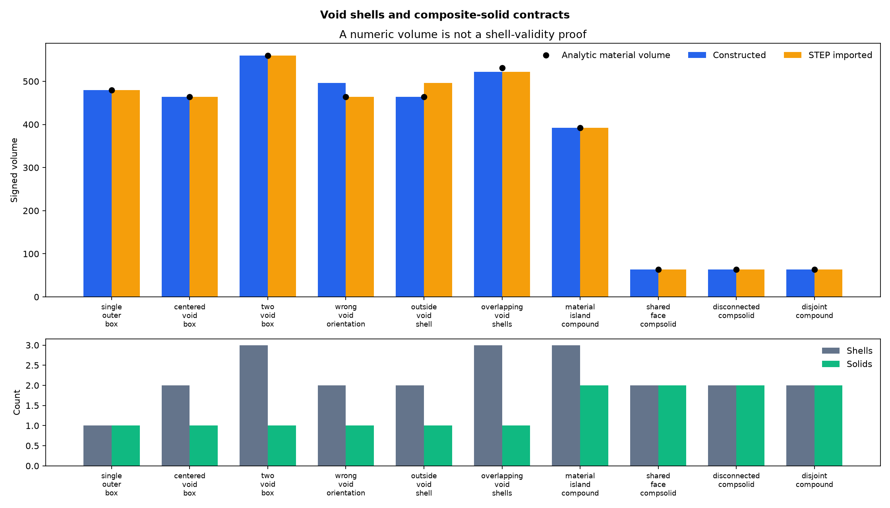

# Voids, Inner Shells, and Composite Solids: Material-Region Contracts

## 日本語概要

本ノートは、外殻、1個・2個の空洞、向きが誤った内殻、外殻外の反転殻、重複空洞、空洞内の別立体、および面共有・非連結の複合立体を合成し、殻の完全包含、向き、符号付き体積、立体間の共有面、隣接成分を構築時とSTEP再読込後に比較します。包含は1点の内外判定だけで決めず、内殻の全体積が外殻との共通部分に含まれることも要求するため、部分的に重なる2空洞は両方とも深さ1・向き正常のまま重複条件だけで明示的に失格になります。数値体積が464で一致しても外部の反転殻は空洞ではなく、STEP往復は誤方向内殻を正規化する一方、面共有複合立体を一般集合へ変換して共有位相面を失いました。英語本文で材料領域の契約、結果、限界を説明します。

---

## English Summary

Ten synthetic controls separate outer shells, void-shell containment and orientation, signed volume, material islands, generic compounds, and face-connected composite solids. A reversed shell outside the outer body produces the same constructed volume as a valid centered void but fails containment. Overlapping voids double-subtract nine volume units. STEP import normalizes one wrong void orientation yet converts a face-connected composite solid into two topologically independent solids in a compound. Volume and container type are therefore observations, not material-region proofs.

## Research Question

How can outer shells, void shells, material islands, compounds, and composite solids be evaluated as explicit material-region claims rather than inferred from one type name or volume number?

## Background

The public STEP schema defines [`brep_with_voids`](https://www.steptools.com/stds/smrl/data/resource_docs/geometric_and_topological_representation/sys/6_schema.htm) as a manifold solid B-Rep with one or more interior voids. Its informal propositions require each void shell to be inside the outer shell and disjoint from the outer and other void shells. The advanced B-Rep requirements specify voids through oppositely oriented closed shells.

Open CASCADE's [`BRepBuilderAPI_MakeSolid`](https://dev.opencascade.org/doc/refman/html/class_b_rep_builder_a_p_i___make_solid.html) constructs a solid from shells but explicitly does not verify their coherence. [`BRepCheck_Solid`](https://dev.opencascade.org/doc/refman/html/class_b_rep_check___solid.html) reports shell overlap, enclosure, and subshape-placement problems. [`BRepClass3d_SolidClassifier`](https://dev.opencascade.org/doc/refman/html/class_b_rep_class3d___solid_classifier.html) classifies a point against a solid. These facilities answer different questions and are retained as separate evidence.

A composite solid is not merely a collection with a different label. Open CASCADE describes [`TopoDS_TCompSolid`](https://dev.opencascade.org/doc/refman/html/class_topo_d_s___t_comp_solid.html) as solids connected by faces. The study therefore tests shared topological faces and the resulting solid-adjacency graph rather than trusting the container type.

## Method

For every direct shell of every solid, the experiment records:

1. signed and absolute shell volume;
2. a deterministic interior witness derived from the bounding box of the controlled convex shell;
3. pairwise witness classification against normalized standalone shell solids;
4. the common volume of each candidate outer/inner shell pair, requiring the
   entire inner-shell volume to be covered before containment is accepted;
5. local and global containment depth;
6. inferred outer or void role; and
7. whether the observed volume sign agrees with local containment depth.

Partial-volume intersections between shells of the same solid identify overlapping shell regions. Exact containment is not counted as overlap. For every pair of solids, the experiment records shared topological faces and common volume, then builds a face-adjacency graph.

The material-region candidate gate requires correct shell orientation, one local root shell per solid, no partial shell overlap, agreement with analytic material volume, and a connected face graph when the constructed container claims to be a composite solid.

The result rows also carry each control's expected constructed candidate state,
shared-face count, and solid-component count beside explicit match flags. These
fields make the preregistered contract executable instead of leaving the values
only in the control catalog.

Each control is written as normalized STEP, imported, and measured again. STEP entity counts for `MANIFOLD_SOLID_BREP`, `BREP_WITH_VOIDS`, `CLOSED_SHELL`, and `ORIENTED_CLOSED_SHELL` are retained with the fixture hashes.

## Controlled Experiment

| Control | Independent material truth | Intended boundary |
| --- | --- | --- |
| `single_outer_box` | Outer volume `480` | One-shell positive control |
| `centered_void_box` | `480 - 16 = 464` | One correctly contained void |
| `two_void_box` | `576 - 8 - 8 = 560` | Two disjoint voids |
| `wrong_void_orientation` | Intended volume `464`; raw constructed sum `496` | Correct containment with wrong inner sign |
| `outside_void_shell` | A reversed volume-16 shell outside the body; raw sum `464` | Numeric match without void containment |
| `overlapping_void_shells` | True union-subtracted material volume `531`; raw shell sum `522` | Two voids overlap by volume `9` |
| `material_island_compound` | `480 - 96 + 8 = 392` | Material island is a second solid, not another void shell |
| `shared_face_compsolid` | Two volume-32 cells, one shared topological face, total `64` | Valid face-connected composite-solid control |
| `disconnected_compsolid` | Two disjoint volume-32 solids | Invalid composite-solid connectivity claim |
| `disjoint_compound` | Same disjoint solids in a generic collection | Collection without connectivity claim |

Run from the repository root:

```bash
python -m pip install -e ".[geometry]"
python experiments/run_solid_region_evaluation.py
```

## Results

The constructed stage accepts six of ten material-region candidates. All ten constructed controls match their declared material-candidate outcome, shared-face count, and solid-component count. The STEP-imported stage accepts eight because the translator normalizes the wrong void orientation and converts the disconnected composite-solid claim into a generic compound. At each stage, two controls have generic kernel validity while failing the project material-region gate.

| Control | Constructed observation | STEP-imported observation |
| --- | --- | --- |
| `single_outer_box` | Solid, one shell, volume `480` | Preserved |
| `centered_void_box` | Two shells, volume `464` | Imported as one solid with the same shell contract |
| `two_void_box` | Three shells, volume `560` | Preserved |
| `wrong_void_orientation` | Volume `496`, orientation contract false | Reoriented to volume `464`; project gate passes |
| `outside_void_shell` | Volume `464`, but two local root shells and containment failure | Split into two solids in a compound; volume becomes `496` |
| `overlapping_void_shells` | Both voids remain at local depth `1` with correct negative orientation; raw volume `522`, analytic material volume `531`, one partial shell overlap | Partial overlap is not misclassified as containment; overlap gate remains false |
| `material_island_compound` | Two solids, three shells, global depths `0,1,2`, volume `392` | Preserved |
| `shared_face_compsolid` | `V=12,E=20,F=11`, shared face `1`, solid graph connected | Becomes a compound with `V=16,E=24,F=12`, shared face `0`, two graph components |
| `disconnected_compsolid` | Container says composite solid; shared face `0`, two graph components | Becomes the same compound representation as `disjoint_compound` |
| `disjoint_compound` | Valid generic collection of two disjoint solids | Preserved |

Five of ten controls change top-level container type across STEP exchange. The maximum imported analytic-volume error is `32`, produced when the outside reversed shell becomes a second positive solid. The STEP bytes for `disconnected_compsolid` and `disjoint_compound` are identical in this controlled writer route, proving that the original kernel container distinction is not represented by these files.




## Interpretation

### Equal volume does not prove an equal material region

Both the valid centered void and the invalid outside reversed shell initially produce volume `464`. Only containment distinguishes them. A scalar volume is an invariant candidate after validity gates, not a substitute for those gates.

### Shell orientation and containment are independent

The wrong-orientation control has correct nesting but adds the inner volume instead of subtracting it. The outside-shell control has the expected negative sign but no containment. Both properties must pass.

### Overlapping voids invalidate simple signed sums

Subtracting two volume-27 void shells from `576` produces `522`, but their nine-unit overlap should be subtracted once, giving `531`. Orientation parity cannot detect this by itself.

The witness of one overlapping box lies inside the other box, but the common volume is only `9`, not the candidate inner-shell volume `27`. The complete-volume containment gate therefore rejects the sibling relationship. Both void shells retain local depth `1` and a correct negative sign. Among the orientation, local-root, and partial-overlap shell gates, only the partial-overlap gate fails; the independent analytic-volume residual remains `9`.

### A material island is a separate solid

The island lies at global nesting depth two, but it is the local outer shell of a second solid. Local shell role and global material parity are different fields.

### Composite-solid meaning can be lost in STEP exchange

The face-connected composite solid has one shared topological face before exchange. The selected STEP route writes two manifold solid B-Reps; import returns a compound with geometrically coincident but topologically distinct boundary faces. A successful round trip preserves total volume but not the cell-complex relationship.

## Failure Modes

- Accepting a void because its shell has a negative signed volume.
- Accepting a material region because total volume matches an expected scalar.
- Assuming nested shell witnesses prove that shells are disjoint.
- Representing a material island as a third void shell of one solid.
- Treating a generic compound as one connected material body.
- Treating a composite-solid type as proof of face connectivity.
- Assuming STEP preserves kernel-specific compound or composite-solid semantics.

## Practical Guidance

1. Enumerate direct shells per solid and retain local ownership.
2. Record containment, orientation, and partial overlap separately.
3. Compare signed shell sum with an independently derived material volume only after shell gates pass.
4. Represent material islands as separate solids.
5. For composite solids, require a connected shared-face graph and zero interior overlap.
6. Preserve pre-export semantic adjacency explicitly when STEP cannot encode it.
7. Report container-type and shared-identity changes after import.
8. Do not silently call translator normalization a repair of source intent.

## Limitations

- Controls use axis-aligned boxes, known analytic volumes, and deterministic convex-shell witnesses.
- Bounding-box-derived witnesses are not a general interior-point algorithm for nonconvex shells; the full-volume check prevents the controlled partial-overlap false containment but is still a same-kernel Boolean test.
- No curved void, tangent shell, thin wall, open inner shell, unbounded solid, or arbitrary nesting depth is tested.
- Partial overlap uses the same geometry kernel as construction and is not independently recomputed by another kernel.
- Product assembly occurrences and placements are outside this shape-container study.
- STEP results describe one pinned writer and reader route; other translators may preserve or normalize different relationships.
- Regression tolerances are fixture-specific and are not universal CAD-quality limits.

## Questions Carried Forward

- Which explicit sidecar relation should preserve composite-solid cell adjacency across STEP exchange?
- Should point or edge contact between separate solids be permitted inside a material-domain collection?
- How can a general nonconvex shell produce a verified interior witness without tessellation-only assumptions?
- When a translator reorients or splits shells, which changes are normalization, repair, or semantic drift?

## Sources

- [Open CASCADE `BRepBuilderAPI_MakeSolid` class reference](https://dev.opencascade.org/doc/refman/html/class_b_rep_builder_a_p_i___make_solid.html)
- [Open CASCADE `BRepCheck_Solid` class reference](https://dev.opencascade.org/doc/refman/html/class_b_rep_check___solid.html)
- [Open CASCADE `BRepClass3d_SolidClassifier` class reference](https://dev.opencascade.org/doc/refman/html/class_b_rep_class3d___solid_classifier.html)
- [Open CASCADE `BRepGProp` class reference](https://dev.opencascade.org/doc/refman/html/class_b_rep_g_prop.html)
- [Open CASCADE `TopoDS_TCompSolid` class reference](https://dev.opencascade.org/doc/refman/html/class_topo_d_s___t_comp_solid.html)
- [STEP `brep_with_voids` schema reference](https://www.steptools.com/stds/smrl/data/resource_docs/geometric_and_topological_representation/sys/6_schema.htm)
- [STEP `brep_with_voids` entity reference](https://www.steptools.com/stds/stp_aim/html/t_brep_with_voids.html)
- [STEP advanced boundary representation information requirements](https://steptools.com/stds/smrl/data/modules/advanced_boundary_representation/sys/4_info_reqs.htm)
