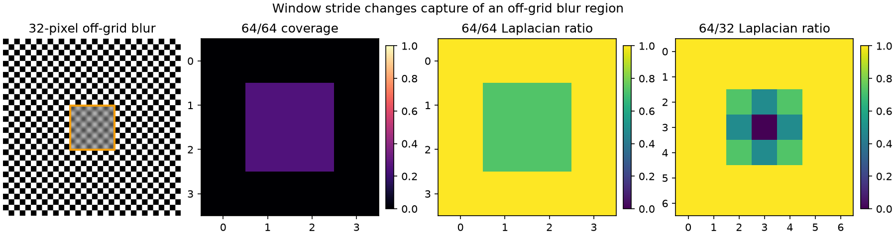
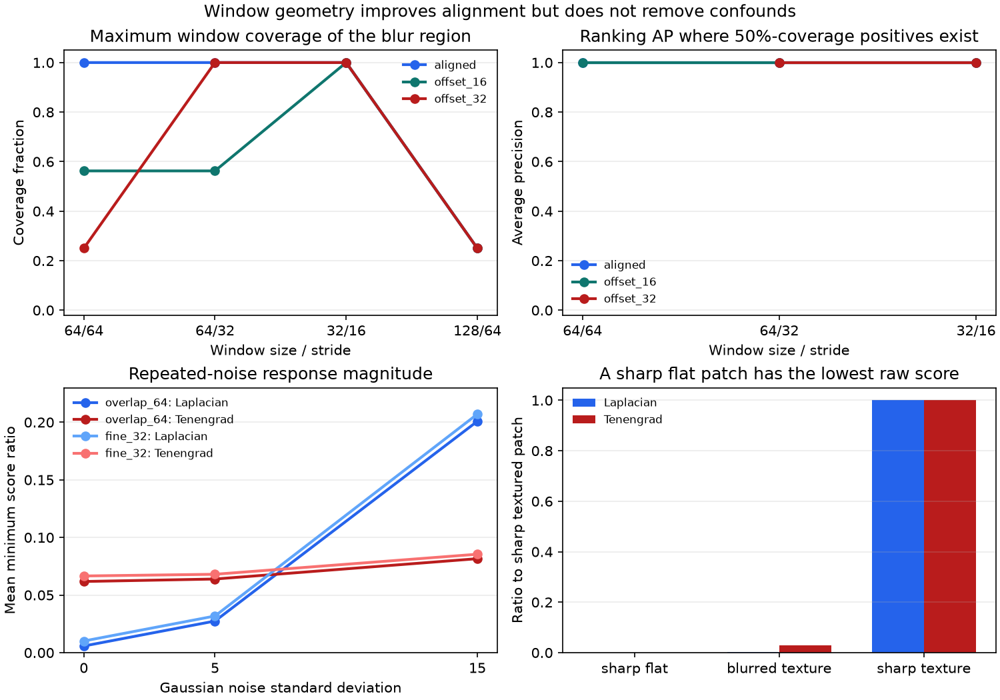

# Window Geometry and Robustness for Local Blur Detection

## Research Question

How do window size, stride, and blur-region alignment change the visibility of
a localized Gaussian blur? Do overlapping or smaller windows remove the noise
and low-texture failure modes of Laplacian variance and Tenengrad energy?

## Background

The v0.3.0 experiment showed that a full-image score can dilute severe blur in
a small region, while a tile map can preserve its location. That experiment
favored the tile map: every blur mask was aligned to a textured 64 x 64 tile,
and there was no noise.

Local measurement replaces one image-level assumption with several geometric
choices. A large window contains more image evidence but mixes a small defect
with its surroundings. A small stride supplies more candidate alignments but
creates overlapping, correlated measurements. A small window improves spatial
resolution but has less content from which to estimate a derivative response.
Focus-measure surveys describe this tradeoff between spatial resolution,
available image information, and robustness. Spatially varying blur methods
therefore use regional or multiscale evidence rather than treating one grid as
intrinsically correct.

This note isolates those choices. It is a controlled sensitivity study, not a
general blur detector or a benchmark on natural images.

## Method

The experiment generates the same three 256 x 256 grayscale patterns as the
v0.3.0 study: a checkerboard, vertical bars, and repeated concentric tiles. A
64 x 64 region is copied from a Gaussian-blurred version into the matching
sharp image. Its top-left coordinate is shifted to three positions:

- `aligned` at (64, 64);
- `offset_16` at (80, 80);
- `offset_32` at (96, 96).

Four regular window grids are evaluated independently:

| Configuration | Window | Stride | Windows per image |
| --- | ---: | ---: | ---: |
| `nonoverlap_64` | 64 x 64 | 64 | 16 |
| `overlap_64` | 64 x 64 | 32 | 49 |
| `fine_32` | 32 x 32 | 16 | 225 |
| `coarse_128` | 128 x 128 | 64 | 9 |

Each observed score is divided by the score from the same window in the
matching sharp pattern. Lower ratios indicate a larger loss of derivative
energy relative to that controlled reference. This normalization is available
because the experiment creates matched controls; an arbitrary input image does
not provide its own sharp reference.

The known blur mask supplies a coverage fraction for evaluation. A window is
labeled positive when at least 50% of its area is covered by the mask. Average
precision (AP) ranks those positives using the negative score ratio. The 50%
rule is only a geometric ground-truth definition for this experiment. It is
not a focus-score threshold or a proposed quality criterion. AP is left blank
when a grid contains no positive window.

Two additional controls test robustness:

1. The `offset_32`, sigma-3 condition is repeated with Gaussian noise standard
   deviations 0, 5, and 15 for ten deterministic seeds per pattern. The
   `overlap_64` and `fine_32` grids are evaluated.
2. A sharp constant patch is compared with a sharp textured patch and a
   sigma-3 blurred textured patch. This deliberately violates the
   texture-sufficiency assumption.

Laplacian variance and area-normalized Tenengrad energy use the definitions and
OpenCV border handling documented in the earlier notes. Every window is
evaluated independently with reflected borders.

## Controlled Experiment

| Factor | Values |
| --- | --- |
| Synthetic pattern | checkerboard, vertical bars, concentric tiles |
| Image size | 256 x 256 pixels |
| Blur-region size | 64 x 64 pixels |
| Gaussian blur sigma | 1, 2, 3 pixels |
| Region placement | aligned, offset by 16 pixels, offset by 32 pixels |
| Window / stride | 64/64, 64/32, 32/16, 128/64 |
| Focus measure | Laplacian variance, area-normalized Tenengrad energy |
| Noise standard deviation | 0, 5, 15 |
| Noise repetitions | 10 deterministic trials per pattern and condition |
| Evaluation label | window coverage of the known mask at least 50% |

The clean geometry experiment contains 8,073 window observations and 216
condition summaries. The repeated-noise control contains 360 observations and
12 summaries. The low-texture control contributes six metric observations.

Reproduce every v0.4.0 artifact from the repository root:

```bash
python -m pip install -e ".[test]"
python -m pytest
python experiments/run_window_geometry_evaluation.py
```

## Results





Window geometry alone determines whether a strongly covered candidate exists.
The maximum blur-mask coverage is independent of pattern, blur sigma, and
metric:

| Window / stride | Aligned | Offset 16 | Offset 32 |
| --- | ---: | ---: | ---: |
| 64/64 | 1.0000 | 0.5625 | 0.2500 |
| 64/32 | 1.0000 | 0.5625 | 1.0000 |
| 32/16 | 1.0000 | 1.0000 | 1.0000 |
| 128/64 | 0.2500 | 0.2500 | 0.2500 |

For the 32-pixel offset, a 64/64 grid splits the region equally across four
windows. None reaches the 50% evaluation label, so AP is undefined. Reducing
the stride to 32 creates a window with full coverage. Reducing the window and
stride to 32/16 also recovers full coverage. A 128-pixel window always dilutes
the 64-pixel region to at most 25% of its area.

At sigma 3 and the 32-pixel offset, mean matched-control ratios across the three
patterns are:

| Window / stride | Coverage | Laplacian ratio | Tenengrad ratio |
| --- | ---: | ---: | ---: |
| 64/64 | 0.25 | 0.747409 | 0.761202 |
| 64/32 | 1.00 | 0.005765 | 0.061776 |
| 32/16 | 1.00 | 0.010137 | 0.067333 |
| 128/64 | 0.25 | 0.736343 | 0.751283 |

The grid with a full-coverage window records a much stronger relative loss
than grids that mix the blur region with sharp surroundings. All clean
conditions that contain at least one positive window have AP 1.0 for both
metrics. The patterns were designed to make the ranking unambiguous, so this
validates the controls rather than estimating real-world accuracy.

For the noisy `offset_32`, sigma-3 condition, localization AP remains 1.0 in
all 360 observations. Score magnitude is less stable:

| Window / stride | Metric | Noise 0 | Noise 5 | Noise 15 |
| --- | --- | ---: | ---: | ---: |
| 64/32 | Laplacian variance | 0.005765 | 0.027440 | 0.200820 |
| 64/32 | Tenengrad energy | 0.061776 | 0.063913 | 0.081578 |
| 32/16 | Laplacian variance | 0.010108 | 0.031808 | 0.207019 |
| 32/16 | Tenengrad energy | 0.066567 | 0.068045 | 0.085442 |

These entries are means of the minimum matched-control ratio over 30
pattern-trial observations. Noise lifts the apparent sharpness response,
especially for Laplacian variance, even though the correct region still ranks
first in this bounded experiment.

The low-texture control is a stronger counterexample. The sharp constant patch
scores 0 for both metrics and ranks below the blurred textured patch. The
blurred textured scores are 108.798828 for Laplacian variance and 11225.718750
for Tenengrad energy, while their sharp textured references are 34671.533203
and 380497.851562. A low derivative score alone therefore does not identify
blur.

## Interpretation

Window geometry sets an observation limit before metric choice matters. If no
window captures enough of the defect, aggregation or threshold tuning cannot
recover evidence that was spatially diluted. Overlap adds candidate alignments
without changing window scale; a smaller window changes both alignment and the
amount of local evidence.

Ranking and response magnitude answer different questions. The noisy trials
retain perfect localization ranking while the minimum Laplacian ratio moves by
more than an order of magnitude. A system that only reports which window is
lowest can appear robust even when a fixed decision boundary would drift.

Overlap also increases sample count without creating independent evidence.
Adjacent windows share most of their pixels, so confidence calculations must
not treat 49 overlapping values as 49 independent observations.

Finally, neither overlap nor a finer grid resolves content ambiguity. Both
metrics measure local derivative activity. A sharp flat patch contains less of
that activity than a blurred textured patch, producing exactly the ordering a
naive blur rule would misinterpret.

## Failure Modes

- **Grid blind spots:** a region split across non-overlapping windows may never
  produce a strongly covered candidate.
- **Spatial dilution:** windows larger than the defect mix blurred and sharp
  evidence even when the grid is well aligned.
- **Low-texture ambiguity:** a sharp flat region can receive the lowest score
  in the image.
- **Noise inflation:** Gaussian noise raises derivative energy and makes blur
  look less severe by raw score or matched-control ratio.
- **Correlated overlap:** neighboring sliding windows share pixels and cannot
  be interpreted as independent measurements.
- **Boundary artifacts:** the hard compositing boundary and per-window
  reflected border can influence derivative responses.
- **Reference dependence:** matched sharp normalization is available in the
  controlled experiment but usually absent in blind inspection.
- **Label dependence:** AP changes with the geometric coverage definition and
  is undefined when the selected grid has no positive window.

## Practical Guidance

- Select window size from the smallest operationally relevant defect, then
  evaluate several offsets instead of testing only an aligned mask.
- Use overlap to reduce alignment blind spots, and document the resulting
  stride and correlation rather than treating extra windows as extra trials.
- Keep regional score maps and visualize candidate locations; one aggregate
  number cannot explain a geometry failure.
- Evaluate localization ranking and score stability separately under expected
  noise and preprocessing.
- Add a texture-sufficiency or confidence signal before interpreting a low
  derivative score as blur.
- Calibrate decisions on representative labeled data from the intended image
  pipeline. Do not transfer the ratios or 50% coverage label from this note as
  a universal threshold.
- Record window size, stride, border behavior, metric definition,
  normalization, and aggregation policy together.

## Limitations

The experiment uses three periodic synthetic patterns, one image size, one
square blur-region size, three offsets, four regular grids, Gaussian blur, and
additive clipped Gaussian noise. The mask has a hard boundary and is created by
copying from a globally blurred image. The noise study fixes sigma 3 and tests
only two grids.

The low-texture control is intentionally simple and does not cover gradual
texture changes, saturation, compression, demosaicing, sharpening, natural
edges, or semantic content. No natural images, human judgments, learned blur
maps, motion blur, or optical defocus models are evaluated. AP is calculated
from known synthetic masks and is not a population estimate or deployment
accuracy claim. No absolute score or normalized ratio is proposed as a
universal quality threshold.

## Sources

- [OpenCV: Image Filtering](https://docs.opencv.org/4.x/d4/d86/group__imgproc__filter.html)
  documents the Gaussian, Laplacian, and Sobel operations and border modes used
  by the implementation.
- [Analysis of focus measure operators for shape-from-focus](https://doi.org/10.1016/j.patcog.2012.11.011)
  evaluates focus measures in local windows and discusses the tradeoff among
  window size, spatial resolution, available information, and noise
  robustness.
- [Discriminative Blur Detection Features](https://openaccess.thecvf.com/content_cvpr_2014/html/Shi_Discriminative_Blur_Detection_2014_CVPR_paper.html)
  evaluates regional features and blur maps, illustrating that local blur
  estimation is distinct from assigning one score to an image.
- [Spatially-Varying Blur Detection Based on Multiscale Fused and Sorted
  Transform Coefficients of Gradient Magnitudes](https://openaccess.thecvf.com/content_cvpr_2017/html/Golestaneh_Spatially-Varying_Blur_Detection_CVPR_2017_paper.html)
  presents multiscale regional evidence for spatially varying blur and
  motivates evaluating more than one spatial support.
